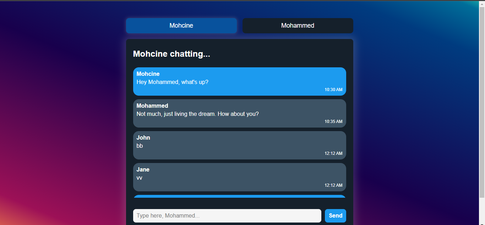

# Simple Chat App

Simple Chat App is a lightweight web application that allows users to chat with each other in real-time. It provides basic functionality for sending and receiving messages between two users, Mohcine and Mohammed.



## Features

- Switch between Mohcine and Mohammed as the message sender.
- Send messages in real-time.
- View chat history and persist messages across page reloads using local storage.
- Clear chat history.

## Installation

1. Clone the repository:

   ```bash
   git clone https://github.com/MohcineSafi/Small-Chat-App.git
   ```

2. Navigate to the project directory:

   ```bash
   cd Small-Chat-App
   ```

3. Open `index.html` in your web browser:

   ```bash
   open index.html
   ```

## Usage

1. Open the app in your web browser.
2. Choose the sender by clicking on either the "Mohcine" or "Mohammed" button.
3. Type your message in the input field and press "Send" to send it.
4. View the messages in the chat area.
5. Use the "Clear Chat" button to clear the chat history.

## Contributing

Contributions are welcome! Please feel free to submit a pull request or open an issue for any bugs, feature requests, or improvements.